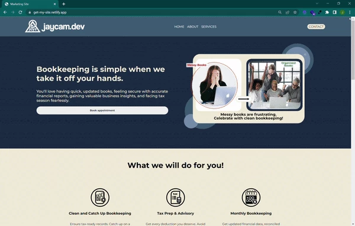

# Get My Site
#### GetMySite is template landing page I created from scratch to be used as the initial format in order to build marketing sites for local small business and solo entrepreneurs.
#### It is also used as a demo to showcase a potential outline for clients to view and be inspired on what I can build for them. 
#### Live Demo: https://get-my-site.netlify.app/

## How It's Made
### Tech used: HTML, SCSS, CSS, JavaSCript 
#### GetMySite is marketing platform specifically tailored for businesses in the niche of bookkeeping and related services. One of its key strengths lies in its robust technical foundation. I meticulously crafted the website using foundational Semantics HTML, ensuring not only its accessibility but also enhancing its search engine optimization (SEO) capabilities. By incorporating semantic HTML, the website is structured in a way that clearly defines different sections and elements, making it easily understandable for both users and search engines.
#### To further enhance the website's aesthetics and functionality, I harnessed the power of SASS (Syntactically Awesome Stylesheets) or SCSS (Sassy CSS). This allowed me to efficiently organize the embedded CSS, ensuring a modular and maintainable codebase. The use of SASS/SCSS not only streamlines the development process but also facilitates easy collaboration and code readability.

#### Moreover, I placed a strong emphasis on creating a seamless user experience across various devices and screen sizes. To achieve this, I implemented responsive design principles. By embracing a mobile-first approach, the website dynamically adapts its layout and content to provide an optimal viewing experience on smartphones, tablets, and desktops. This responsive design ensures that visitors can access and interact with the site effortlessly, regardless of the device they are using.

#### In addition to the visually appealing design and smooth user experience, I incorporated basic JavaScript functionalities. JavaScript was employed for essential tasks such as Document Object Model (DOM) manipulation, enabling dynamic content updates without requiring a page reload. Furthermore, JavaScript was utilized to seamlessly integrate the Calendly plugin, enhancing the website's interactivity by allowing users to schedule appointments and engagements with bookkeeping professionals directly through the site.

#### In summary, GetMySite stands as a testament to meticulous web development, combining the power of semantic HTML, SASS/SCSS organization, responsive design, and strategic JavaScript implementation. This holistic approach not only ensures the site's accessibility and SEO friendliness but also provides visitors with an engaging and user-friendly experience, making it a valuable asset for businesses in the bookkeeping and service-related industry.

## Lessons Learned: 
#### Developing GetMySite proved to be an invaluable learning experience, unveiling a plethora of insights in the realm of web development. Through extensive research and hands-on development, I not only honed my engineering skills but also delved deeply into the nuances of user interface (UI) and user experience (UX) design. This journey provided profound insights into how users can be enticed to actively engage with a website and even make purchases.

#### One key revelation pertained to the significance of the Hero section, where the emphasis lies in elucidating the reasons behind a user's visit and the potential outcomes of engaging with our services. By effectively communicating the 'whys' and the tangible results users could achieve by collaborating with us, we could significantly influence their decision-making processes. I discovered that pairing compelling images with concise descriptions of benefits captivated users, enticing them to delve deeper into the content.

#### Furthermore, I learned the power of incorporating videos into the website. Not only do they enhance the overall user experience, but they also serve as a potent tool for retaining user interest. Videos, with their dynamic and engaging nature, proved to be effective in prolonging the duration users spent on the site, allowing for more profound interactions with our content.

#### Testimonials emerged as a critical element in building trust and credibility. Genuine feedback from satisfied clients served as persuasive testimonials, convincing potential customers to take the leap. These testimonials, bolstered by real experiences, played a pivotal role in encouraging users to make informed decisions.

#### Additionally, integrating a seamless scheduling tool like Calendly was a game-changer. By eliminating friction in the scheduling process, we made it incredibly convenient for potential leads to connect with us. This frictionless interaction not only enhanced user experience but also significantly increased the number of valuable leads generated through the website.

#### In essence, the process of developing GetMySite illuminated the intricate dynamics of user engagement. It taught me that the fusion of compelling visuals, persuasive content, authentic testimonials, and user-friendly tools is pivotal. This holistic approach not only draws users in but also keeps them engaged, fostering trust and ultimately driving meaningful interactions and conversions on the site.

